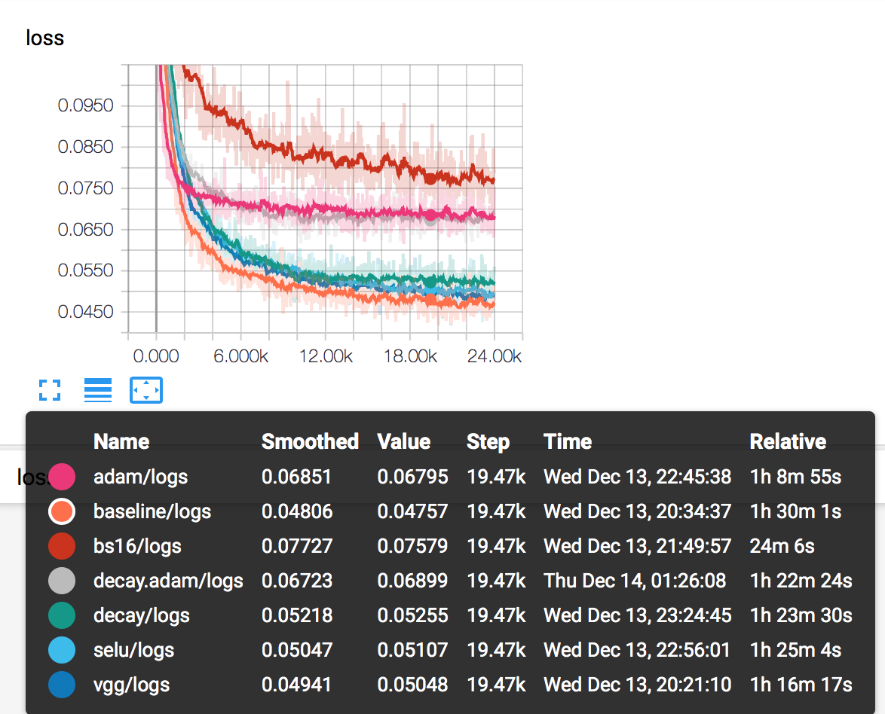

# pytorch_captcha_rec

A simple captcha recognize program based on pytorch 

###preparation
Some dependencies is needed as follow 
* pytorch
* tensorboard
* tqdm 
* numpy
* captcha

###To Run 
Train the model with `python3 train.py` and verify the model with `python3 train.py -v`. If you want to speed up the processes with gpu, you can use -g . See `train.py -h` for more information. 

This training process take you about 2 hours if you have an GTX 1080 Ti.

###Result 
Here we do some experiment and get the 50% accuracy. The working logs tabel is showing below.

Here is our [report](www.flozber.com/share/pytorch_captcha_rec_report.pdf)
